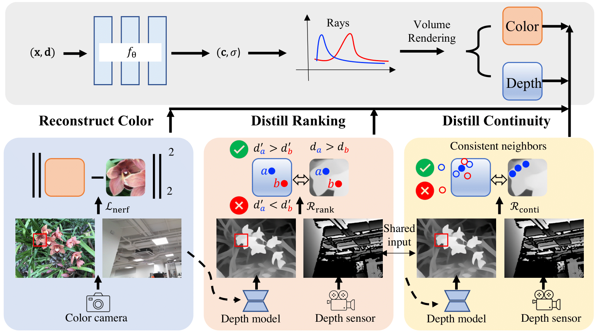

<div align="center">

<h1>SparseNeRF: Distilling Depth Ranking for Few-shot Novel View Synthesis </h1>


<div>
    <a href='https://wanggcong.github.io/' target='_blank'>Guangcong Wang</a>&emsp;
    <a href='https://frozenburning.github.io/' target='_blank'>Zhaoxi Chen</a>&emsp;
    <a href='https://www.mmlab-ntu.com/person/ccloy/' target='_blank'>Chen Change Loy</a>&emsp;
    <a href='https://liuziwei7.github.io/' target='_blank'>Ziwei Liu</a>
</div>
<div>
    S-Lab, Nanyang Technological University
</div>

<div>
    ICCV 2023
</div>


### :baby_chick: [Project](https://sparsenerf.github.io/) | [YouTube](https://www.youtube.com/watch?v=V0yCTakA964) | [arXiv](https://arxiv.org/abs/2303.16196) 
<div>

</div>
    

<!---->
<tr>
    
</tr>
</div>


>:baby_chick: **Update**:
- [20231011] Added a [poster](https://docs.google.com/presentation/d/1cEhC97jnLvVDyh33q-vRo_5Ook0y8mTV/edit?usp=sharing&ouid=115205863499027963192&rtpof=true&sd=true).
- [20231010] Fixed datasets_depth_kinect.py and datasets_depth_zed.py
- [20230906] :loudspeaker: **[Tutorial: Detailed explanation of SparseNeRF, slide, figure+pseudo algorithm table](https://docs.google.com/presentation/d/19d18NnuYyX4f8lD0Y9Df0AE4XWYLsblc/edit?usp=sharing&ouid=115205863499027963192&rtpof=true&sd=true)** A tutorial on how to implement SparseNeRF is released. 
- [20230822] Add a tutorial on how to **[integrate SparseNeRF into your own dataset](https://github.com/Wanggcong/SparseNeRF/blob/main/tutorial/tutorial.md)**.
- [20230820] Add **[FreeNeRF w/ SparseNeRF](https://github.com/Wanggcong/FreeNeRF_plus_SparseNeRF)**, which achieves better results. It shows that our SparseNeRF might be integrated into other methods.
- [20230814] Code released. Please let us know if any bug exists. We summarize the frequently asked issues in **[FAQ](https://github.com/Wanggcong/SparseNeRF/blob/main/FQA.md)**.
- [20230806] We are working very hard on releasing the code. We expect to release the code in a few days.
- [20230328] Released **[Project](https://sparsenerf.github.io/) | [YouTube](https://www.youtube.com/watch?v=V0yCTakA964)** | **[arXiv](https://arxiv.org/abs/2303.16196)**.
- [20221004] The **[old version of SparseNeRF](https://github.com/Wanggcong/SparseNeRF_old)** was released. The performance would be slightly worse than the current version.


>:baby_chick: **Features**:
- :white_check_mark: Applied for General scenes. Depth maps from pre-trained monocular depth estimation or depth sensors, which are coarse and easy to obtain. 
- :white_check_mark: Only 1 GPU for training and test. Training a scene requires about 2 hours.
- :white_check_mark: **[Combine SparseNeRF with other methods](https://github.com/Wanggcong/FreeNeRF_plus_SparseNeRF)**: **FreeNeRF w/ SparseNeRF**, which achieves better results. It shows that our SparseNeRF might be integrated into other methods.
- :white_check_mark: **[FAQ](https://github.com/Wanggcong/SparseNeRF/blob/main/FQA.md)**: A frequently asked questions (FAQ) list.
- :white_check_mark: **[Use your dataset](https://github.com/Wanggcong/SparseNeRF/blob/main/tutorial/tutorial.md)**: A tutorial on how to use **your own dataset**.
- :white_check_mark: **[Tutorial: Detailed explanation of SparseNeRF, slide, figure+pseudo algorithm table](https://docs.google.com/presentation/d/19d18NnuYyX4f8lD0Y9Df0AE4XWYLsblc/edit?usp=sharing&ouid=115205863499027963192&rtpof=true&sd=true)**: A tutorial on how to implement SparseNeRF is released. If you cannot open the link, you can download it in the tutorial folder.
- :white_check_mark: A **[poster](https://docs.google.com/presentation/d/1cEhC97jnLvVDyh33q-vRo_5Ook0y8mTV/edit?usp=sharing&ouid=115205863499027963192&rtpof=true&sd=true)** for the overview. Also see **[Project](https://sparsenerf.github.io/) | [YouTube](https://www.youtube.com/watch?v=V0yCTakA964)** | **[arXiv](https://arxiv.org/abs/2303.16196)**. 

>:baby_chick: **TL;DR**: We present SparseNeRF, a simple yet effective method that synthesizes novel views given a few images. SparseNeRF distills robust local depth ranking priors from real-world inaccurate depth observations, such as pre-trained monocular depth estimation models or consumer-level depth sensors.

>:baby_chick: **Abstract:** Neural Radiance Field (NeRF) significantly degrades when only a limited number of views are available. To complement the lack of 3D information, depth-based models, such as DSNeRF and MonoSDF, explicitly assume the availability of accurate depth maps of multiple views. They linearly scale the accurate depth maps as supervision to guide the predicted depth of few-shot NeRFs. However, accurate depth maps are difficult and expensive to capture due to wide-range depth distances in the wild. 

>In this work, we present a new Sparse-view NeRF (**SparseNeRF**) framework that exploits depth priors from real-world inaccurate observations. The inaccurate depth observations are either from pre-trained depth models or coarse depth maps of consumer-level depth sensors. Since coarse depth maps are not strictly scaled to the ground-truth depth maps, we propose a simple yet effective constraint, a local depth ranking method, on NeRFs such that the expected depth ranking of the NeRF is consistent with that of the coarse depth maps in local patches. To preserve the spatial continuity of the estimated depth of NeRF, we further propose a spatial continuity constraint to encourage the consistency of the expected depth continuity of NeRF with coarse depth maps. Surprisingly, with simple depth ranking constraints, SparseNeRF outperforms all state-of-the-art few-shot NeRF methods (including depth-based models) on standard LLFF and DTU datasets. Moreover, we collect a new dataset NVS-RGBD that contains real-world depth maps from Azure Kinect, ZED 2, and iPhone 13 Pro. Extensive experiments on NVS-RGBD dataset also validate the superiority and generalizability of SparseNeRF.

<div align="center">
<tr>
    
</tr>
</div>

>:baby_chick: **Framework Overview:** SparseNeRF consists of two streams, i.e., NeRF and depth prior distillation. As for NeRF, we use Mip-NeRF as the backbone. we use a NeRF reconstruction loss. As for depth prior distillation, we distill depth priors from a pre-trained depth model. Specifically, we propose a local depth ranking regularization and a spatial continuity regularization to distill robust depth priors from coarse depth maps.


## 1. Prerequisites
- Linux or macOS
- Python 3.6.13
- NVIDIA GPU + CUDA cuDNN(10.1)
- OpenCV

## 2. Installation
We recommend using the virtual environment (conda) to run the code easily.

```
conda create -n sparsenerf python=3.6.13
conda activate sparsenerf
pip install -r requirements.txt
```

Download jax+cuda (jaxlib-0.1.68+cuda101-cp36) wheels from [this link](https://storage.googleapis.com/jax-releases/jax_cuda_releases.html) by

```
wget https://storage.googleapis.com/jax-releases/cuda101/jaxlib-0.1.68+cuda101-cp36-none-manylinux2010_x86_64.whl
```

```
pip install jaxlib-0.1.68+cuda101-cp36-none-manylinux2010_x86_64.whl
```

```
rm jaxlib-0.1.68+cuda101-cp36-none-manylinux2010_x86_64.whl
```

Install pytorch and related packages for pretrained depth models
```
conda install pytorch==1.7.1 torchvision==0.8.2 torchaudio==0.7.2 cudatoolkit=10.1 -c pytorch
pip install timm
pip install opencv-python
```

Install ffmpeg for composing videos
```
pip install imageio-ffmpeg
```
## 3. Dataset

### 3.1 Download DTU dataset
- Download the DTU dataset from the [official website](https://roboimagedata.compute.dtu.dk/?page_id=36/), "Rectified (123 GB)" and "SampleSet (6.3 GB)"
- Data: extract "Rectified (123 GB)"
- Poses: extract "SampleSet/MVS\ Data/Calibration/cal18/" from "SampleSet (6.3 GB)"
- Masks: download masks (used for evaluation only) from [this link](https://drive.google.com/file/d/1Yt5T3LJ9DZDiHbtd9PDFNHqJAd7wt-_E/view?usp=sharing)
- Get depth maps, For both LLFF and DTU, please set the variables $root_path, $benchmark, and $dataset_id in get_depth_map.sh, and run:
```
sh scripts/get_depth_map_for_dtu.sh
```

### 3.2 Download LLFF dataset
- Download LLFF from [the official download link](https://drive.google.com/drive/folders/128yBriW1IG_3NJ5Rp7APSTZsJqdJdfc1).
- Get depth maps, For both LLFF and DTU, please set the variables $root_path, $benchmark, and $dataset_id in get_depth_map.sh, and run:
```
sh scripts/get_depth_map_for_llff.sh
```


### 3.3 Download NVS-RGBD dataset
- Download NVS-RGBD from the [official website link](https://drive.google.com/drive/folders/1gDVZomm0AGpgIja19Lbg4oJQmvHB30rB?usp=sharing)


## 4. Training 

### 4.1 Training on LLFF
Please set the variables in scripts/train_llff.sh and configs/llff3.gin, and run:
```
sh scripts/train_llff.sh
```


### 4.2 Training on DTU
Please set the variables in train_dtu3.sh, and run:

```
sh scripts/train_dtu.sh
```
### 4.3 Training on NVS-RGBD
Similar to 4.1 and 4.2. The depth maps are from depth sensors.


```
sh scripts/train_kinect.sh
```

```
sh scripts/train_zed.sh
```

```
sh scripts/train_iphone.sh
```

## 5. Test 
### 5.1 Evaluation on LLFF
Please set the variables (the same as train_llff3.sh and train_dtu3.sh) in eval_llff3.sh or eval_dtu3, and run:
```
sh scripts/eval_llff.sh
```

### 5.2 Evaluation on DTU
```
sh scripts/eval_dtu.sh
``` 

### 5.3 Evaluation on NVS-RGBD
```
sh scripts/eval_kinect.sh
``` 
```
sh scripts/eval_zed.sh
``` 
```
sh scripts/eval_iphone.sh
``` 
## 6 (Optional) Render videos
Please set the variables (the same as train_llff.sh and train_dtu.sh) in render_llff.sh or render_dtu.sh, and run.

### 6.1 Render videos on LLFF
```
sh scripts/render_llff.sh
```

### 6.2 Render videos on DTU
```
sh scripts/render_dtu.sh
```

### 6.3 Render videos on NVS-RGBD
```
sh scripts/render_kinect.sh
```
```
sh scripts/render_zed.sh
```
```
sh scripts/render_iphone.sh
```

## 7 (Optional) Compose videos
Please set the variables in generate_video_llff.sh or other scripts, and run.
### 7.1 Compose videos on LLFF
```
sh generate_video_llff.sh
```
### 7.2 Compose videos on DTU
```
sh generate_video_dtu.sh
```
### 7.3 Compose videos on NVS-RGBD
```
sh generate_video_kinect.sh
```
```
sh generate_video_zed.sh
```
```
sh generate_video_iphone.sh
```

## 8 (Optional) Tensorboard for visualizing training if necessary.
```
tensorboard --logdir=./out/xxx/ --port=6006
```
If it raises errors, see Q2 of [FQA](https://github.com/Wanggcong/SparseNeRF/blob/master/FQA.md)


## 9. Citation

If you find this useful for your research, please cite the our paper.

```
@inproceedings{wang2022sparsenerf,
   author    = {Wang, Guangcong and Chen, Zhaoxi and Loy, Chen Change and Liu, Ziwei},
   title     = {SparseNeRF: Distilling Depth Ranking for Few-shot Novel View Synthesis},
   booktitle = {IEEE/CVF International Conference
on Computer Vision (ICCV)},   
   year      = {2023},
  }
```

or
```
Guangcong Wang, Zhaoxi Chen, Chen Change Loy, and Ziwei Liu. SparseNeRF: Distilling Depth Ranking for Few-shot Novel View Synthesis, IEEE/CVF International Conference on Computer Vision (ICCV) 2023.
```

## 10. Related Links


[RegNeRF: Regularizing Neural Radiance Fields for View Synthesis from Sparse Inputs, CVPR, 2022](https://m-niemeyer.github.io/regnerf/index.html)

[ViTA: Video Transformer Adaptor for Robust Video Depth Estimation](https://github.com/KexianHust/ViTA)

[Traditional Classification Neural Networks are Good Generators: They are Competitive with DDPMs and GANs](https://classifier-as-generator.github.io/)

[SceneDreamer: Unbounded 3D Scene Generation from 2D Image Collections](https://scene-dreamer.github.io/)

[StyleLight: HDR Panorama Generation for Lighting Estimation and Editing, ECCV 2022](https://github.com/Wanggcong/StyleLight).

[Text2Light: Zero-Shot Text-Driven HDR Panorama Generation](https://frozenburning.github.io/projects/text2light/)

[Relighting4D: Neural Relightable Human from Videos, ECCV 2022](https://github.com/FrozenBurning/Relighting4D)


